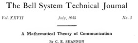
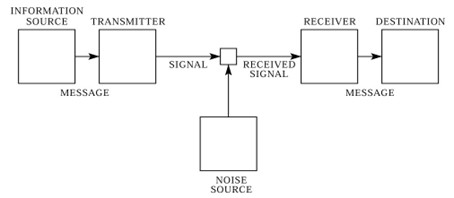
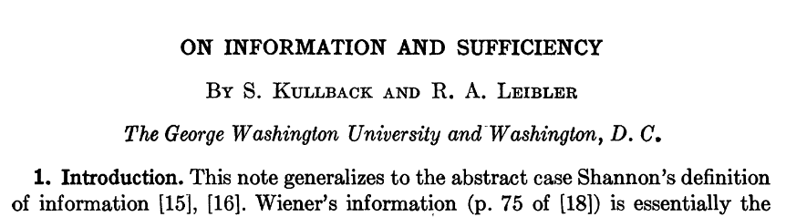

# Découvrir l'Entropie 

> **Activité pédagogique interactive** pour découvrir le concept d'entropie de Shannon et son utilisation en Apprentissage Machine.

---
# 📖 Activité 1 - L'entropie

## 🎯 Objectif

Cette activité permet de s'initier à la théorie de l'information de Claude Shannon et de discuter son application dans le domaine de l'intelligence artificielle.

---

## 📚 Contexte historique

  
   
  <em>Figure 1 : Schéma de communication de Shannon (1948)</em>

Shannon est un pionnier involontaire de l'Intelligence Artificielle. Dans un célèbre article de 1948, il aborde la question suivante : comment peser l'information qui, émise depuis un émetteur sous forme de message, passe dans un canal de diffusion — éventuellement bruité — pour ensuite être reproduit pour un récepteur ? (Shannon, 1948, fig.2).  "Messages" et "transmetteurs" sont à prendre dans un sens très large, ils peuvent désigner :

  
   
  <em>Figure 2 : Le problème initial de Shannon (1948).</em>

| Messages | Transmetteurs |
|----------|---------------|
| Des textes | Un microphone téléphonique (qui convertit la voix en signaux électriques) |
| Des signaux vocaux | Un équipement télégraphique (codant les lettres en impulsions) |
| Des images | Un émetteur radio (modulant l'information sur une onde porteuse) |
| Des données binaires | Un circuit électrique avec des portes logiques "ouvert/fermé" |

La démarche de Shannon est précurseur de l'informatique théorique, dans la forme qu'on lui connaît maintenant (le mot informatique sera introduit bien plus tard dans les années 70). Bien que centré sur des problèmes de communication, il donne dans cet article un sens au mot information qui n'est pas relié au *sens* de cette information. Il faut comprendre l'importance de cette remarque : Shannon distingue à priori information et sémantique, ce qui a été un point de bascule majeur pour le développement de l'informatique. L'article introduit deux concepts majeurs. Tout d'abord, l'unité de l'information est le *bit* (un nombre décimal). Ensuite, la mesure de l'information sera une fonction mathématique que Shannon décide d'appeler *entropie* en relation avec le concept du même nom en thermodynamique.

L'activité consiste à découvrir le point suivant :

**L'entropie correspond au nombre minimum théorique de bits qu'il faut pour coder un message.**

---

## 📚 Valeur de l'information et incertitude

L'observation clé de Shannon est qu'un message est d'autant plus informatif que sa probabilité d'apparaître est faible. De plus, Shannon fait un astucieux parallèle entre *information* d'un côté et *incertitude* de l'autre: l'incertitude est d'autant plus forte qu'il faut beaucoup d'information pour la combler. 

Ces deux remarques sont au coeur de l'apprentissage machine.

### Exemple 1
Imaginons que l'on soit un 27 février au Québec. Le message ***"Il fait froid aujourd'hui"*** est peu informatif, car sa probabilité d'apparaître un 27 février est très forte. En revanche le message ***"Il fait 15°C aujourd'hui"*** est à très haute valeur informative car sa probabilité est très très faible. De fait, cet évènement exceptionnel est arrivé une fois, en 2024 comme le relate [l'article suivant](https://www.journaldemontreal.com/2024/02/27/chaud-pour-un-mois-de-fevrier-des-records-de-temperature-battus-mardi-au-quebec).

### Exemple 2
Plaçons nous maintenant dans la peau d'un médecin qui reçoit un patient. Si le patient déclare ***"j'ai mal à la gorge"*** (très fréquent et donc probable), le médecin reste dans une forte ***incertitude*** car le spectre de diagnostic est très très large à ce stade, il devra beaucoup plus d'information pertinente pour établir un diagnostic différentiel.  En revanche, si le patient déclare ***"je viens vous voir car je me suis fait mordre par un Mamba noir"*** (très peu probable), le médecin est dans une très forte ***certitude***, il sait immédiatement ce qu'il faut faire (injecter un sérum antivenimeux).

---

## 🌐 Pour clarifier ces différents concepts, allons à la rencontre de l'entropie

  <a href="https://nablanabla.github.io/entropie-interactive/activite-entropie/" target="_blank" rel="noopener noreferrer">
    <strong>🚀 Lancer l'activité interactive "À la découverte de l'entropie"</strong>
  </a>

---

# 📖 Activité 2 - L'entropie croisée

## 📚 Contexte historique

En 1951, Solomon Kullback et Richard Leibler étendent le concept d'entropie de Shannon (qui ne mesure l'incertitude que d'une seule distribution) pour mesurer la distance entre deux distributions statistiques.

  
   
  <em>Figure 3 : L'article fondateur de Kullback et Leiber (1951)</em>

### Problématique: comment mesurer l'écart entre deux distributions de probabilité ?

Cette question est fondamentale en apprentissage machine : elle permet d'évaluer à quel point une prédiction s'écarte de la réalité.

### 🩺 Exemple : Évaluer deux étudiants résidents en médecine 

Deux étudiants en médecine doivent établir un diagnostic différentiel pour un patient présentant des symptômes complexes. Un expert a analysé le cas et donne sa distribution de probabilité pour 4 diagnostics possibles. On soumet ces diagnostics à deux étudiants en médecine qui doivent établir leur propre distribution de probabilité (sans connaître celle de l'expert évidemment). 

**Les distributions de probabilité obtenus :**

| | **D₁** | **D₂** | **D₃** | **D₄** | **Caractéristique** |
|---|---|---|---|---|---|
| **Expert (P)** | **80%** | 10% | 5% | 5% | Distribution de référence |
| **Étudiant 1 (Q₁)** | 50% | 20% | 15% | 15% | *Approche prudente, sous-estime modérément D₁* |
| **Étudiant 2 (Q₂)** | 15% | 35% | 25% | 25% | *Erreur majeure : pense que D₁ est peu probable !* |

**Question : quel étudiant est le plus proche de l'expert ?**
Pour y répondre passer à l'activité 2:

  <a href="https://nablanabla.github.io/entropie-interactive/activite-entropie-croisee/" target="_blank" rel="noopener noreferrer">
    <strong>🚀 Lancer l'Activité 2 : "L'entropie croisée"</strong>
  </a>

---

## 🎓 Utilisation pédagogique

### Pour les enseignants

Cette activité vise à faire un découvrir le concept d'information au sens de l'informatique

**Durée estimée :** 20-30 minutes

---

## 📝 Références

Shannon, C. E. (1948). A mathematical theory of communication. *The Bell System Technical Journal*, **27**(3), 379–423.

Kullback, S., & Leibler, R. A. (1951). On information and sufficiency. *The Annals of Mathematical Statistics*, **22**(1), 79–86.

---

## 👨‍🏫 Auteur

**Alban Da Silva**  
Chargé d'Enseignement en Médecine - Faculté de Médecine  
Université Laval, Québec, Canada

**Contexte :** Cours "Culture Numérique en Sciences de la Santé"

---

## 📄 Licence

Ce contenu pédagogique est sous licence [Creative Commons BY-NC-SA 4.0](https://creativecommons.org/licenses/by-nc-sa/4.0/).

Vous êtes libre de :
- ✅ **Partager** 
- ✅ **Adapter** 

Sous les conditions suivantes :
- 📝 **Attribution** — créditer l'auteur
- 🚫 **Pas d'utilisation commerciale**
- 🔄 **Partage dans les mêmes conditions**

---

## 🤝 Contributions

Les suggestions d'amélioration sont les bienvenues ! 

**Pour signaler un bug ou proposer une amélioration :**
- Ouvrir une [Issue](https://github.com/VOTRE-USERNAME/entropie-interactive/issues)
- Ou me contacter directement

---

## 📅 Historique des versions

- **v1.0** (Février 2026) - Version initiale avec 7 sections interactives
- Ajout images contextuelles Shannon

---

## 💡 Technologies utilisées

---

⭐ **Si cette activité vous a été utile, n'hésitez pas à mettre une étoile sur le dépôt !**
