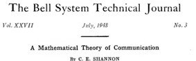
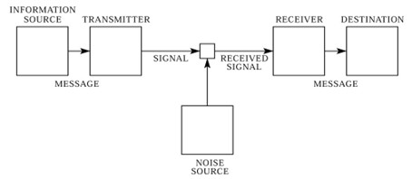
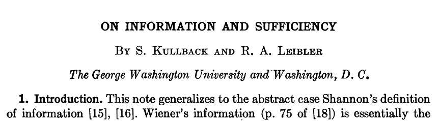

# Les concepts fondamentaux de l'apprentissage machine : entropie et entropie croisée 

> **Activité pédagogique interactive** pour découvrir le concept d'entropie de Shannon et son utilisation en Apprentissage Machine.

---
# 📖 Activité 1 - L'entropie

## 🎯 Objectif

Cette activité permet de s'initier à la théorie de l'information de Claude Shannon et de son application dans le domaine de l'intelligence artificielle.

---

## 📚 Contexte historique

  
   
  <em>Figure 1 : L'article fondateur de Shannon (1948)</em>

Shannon est un pionnier involontaire de l'Intelligence Artificielle. Dans un célèbre article de 1948, il aborde la question suivante : comment mesurer l'information qui, émise depuis un émetteur sous forme de message, passe dans un canal de diffusion — éventuellement bruité — pour ensuite être acheminée jusqu'à un récepteur ? (Shannon, 1948, fig.2).  

  
   
  <em>Figure 2 : Le problème initial de Shannon (1948).</em>

"Messages" et "transmetteurs" sont à prendre dans un sens très large, ils peuvent désigner :

| Messages | Transmetteurs |
|----------|---------------|
| Des textes | Un microphone téléphonique (qui convertit la voix en signaux électriques) |
| Des signaux vocaux | Un équipement télégraphique (codant les lettres en impulsions) |
| Des images | Un émetteur radio (modulant l'information sur une onde porteuse) |
| Des données binaires | Un circuit électrique avec des portes logiques "ouvert/fermé" |

La démarche de Shannon est précurseure de l'informatique théorique, dans la forme qu'on lui connaît aujourd'hui - le mot informatique sera introduit bien plus tard dans les années 70. Bien qu'il se focalise sur des problèmes de communication, il donne dans cet article une définition du mot *information* qu'il décorrèle du *sens* de cette information. Il faut comprendre l'importance de cette remarque : Shannon distingue information et sémantique, ce qui a été un point de bascule majeur pour le développement de l'informatique. L'article introduit deux concepts centraux. Tout d'abord, l'unité d'information est le *bit* (un nombre décimal). Ensuite, la mesure de l'information sera une fonction mathématique que Shannon décide d'appeler *entropie* en relation avec le concept du même nom en thermodynamique.

L'activité consiste à découvrir le point suivant :

**L'entropie correspond au nombre minimum théorique de bits qu'il faut pour coder un message.**

---

## 📚 Valeur de l'information et incertitude

L'observation clé de Shannon est qu'un message est d'autant plus informatif que sa probabilité d'apparaître est faible. De plus, Shannon fait un astucieux parallèle entre *information* d'un côté et *incertitude* de l'autre: l'incertitude est d'autant plus forte qu'il faut beaucoup d'information pour la diminuer. 

Ces deux remarques sont au coeur de l'apprentissage machine.

### Exemple 1
Imaginons que l'on soit un 27 février au Québec. Le message ***"Il fait froid aujourd'hui"*** est peu informatif, car sa probabilité d'apparaître un 27 février est très forte. En revanche le message ***"Il fait 15°C aujourd'hui"*** est à très haute valeur informative car sa probabilité est très très faible. De fait, cet évènement exceptionnel est arrivé une fois, en 2024 comme le relate [l'article suivant](https://www.journaldemontreal.com/2024/02/27/chaud-pour-un-mois-de-fevrier-des-records-de-temperature-battus-mardi-au-quebec).

### Exemple 2
Plaçons nous maintenant dans la peau d'un médecin qui reçoit un patient. Si le patient déclare ***"j'ai mal à la gorge"*** (très fréquent et donc probable), le médecin reste dans une forte ***incertitude*** car le spectre de diagnostic est très très large à ce stade, il aura besoin de beaucoup plus d'information pertinente pour établir un diagnostic différentiel.  En revanche, si le patient déclare ***"je viens vous voir car je me suis fait mordre par un Mamba noir"*** (très peu probable), cela apporte beaucoup d'information au médecin. Ici il sait même immédiatement ce qu'il faut faire (injecter un sérum antivenimeux) ! 

---

## 🌐 Pour clarifier ces différents concepts, allons à la rencontre de l'entropie

  <a href="https://nablanabla.github.io/entropie-interactive/activite-entropie/" target="_blank" rel="noopener noreferrer">
    <strong>🚀 Lancer l'activité interactive "À la découverte de l'entropie"</strong>
  </a>

---

# 📖 Activité 2 - L'entropie croisée

## 📚 Contexte historique

En 1951, Solomon Kullback et Richard Leibler étendent le concept d'entropie de Shannon (qui ne mesure l'incertitude que d'une seule distribution) pour mesurer la distance entre deux distributions statistiques.

  
   
  <em>Figure 3 : L'article fondateur de Kullback et Leiber (1951)</em>

### Problématique: comment mesurer l'écart entre deux distributions de probabilité ?

Cette question est fondamentale en apprentissage machine : elle permet d'évaluer à quel point une prédiction s'écarte de la réalité.

### 🩺 Exemple : Évaluer deux étudiants résidents en médecine 

Deux étudiants en médecine doivent établir un diagnostic différentiel pour un patient présentant des symptômes complexes. Un expert a analysé le cas et donne sa distribution de probabilité pour 4 diagnostics possibles. On soumet ces diagnostics à deux étudiants en médecine qui doivent établir leur propre distribution de probabilité (sans connaître celle de l'expert évidemment). 

**Les distributions de probabilité obtenus :**

| | **D₁** | **D₂** | **D₃** | **D₄** | 
|---|---|---|---|---|
| **Expert (P)** | **80%** | 10% | 5% | 5% | 
| **Étudiant 1 (R1)** | 50% | 20% | 15% | 15% | 
| **Étudiant 2 (R2)** | 25% | 25% | 25% | 25% | 

**Questions : 1/ quel étudiant est le plus proche de l'expert ? et 2/ À quel point le plus loin est loin ?**
Pour y répondre passer à l'activité 2:

  <a href="https://nablanabla.github.io/entropie-interactive/activite-entropie-croisee/" target="_blank" rel="noopener noreferrer">
    <strong>🚀 Lancer l'Activité 2 : "L'entropie croisée"</strong>
  </a>

---

## 📚 Pour conclure: différence entre information au sens de Shannon et pertinence diagnostique

### Le piège conceptuel

La théorie de Shannon mesure l'**information** comme la "surprise" : un événement rare (p faible) apporte beaucoup d'information car il est inattendu.

**Mais attention :** Shannon décorrèle information et sémantique. En médecine, un symptôme peut être très **informatif au sens de Shannon** (rare, surprenant) ET pourtant **peu utile diagnostiquement** (non spécifique). L'inverse est vrai !

### Les quatre cas possibles

| | **Symptôme fréquent** (p élevé) | **Symptôme rare** (p faible) |
|---|---|---|
| **Symptôme spécifique** (peu de diagnostics compatibles) | 📉 **Faible** information Shannon ✅ **Haute** pertinence diagnostique  *Exemple : Fièvre dans la grippe* Symptôme banal mais qui oriente bien | 📈 **Haute** information Shannon ✅ **Haute** pertinence diagnostique  *Exemple : Éruption lupique pathognomonique* Rare ET spécifique = diagnostic quasi certain |
| **Symptôme non spécifique** (beaucoup de diagnostics compatibles) | 📉 **Faible** information Shannon ❌ **Faible** pertinence diagnostique  *Exemple : Fatigue vague* Banal et compatible avec 100 maladies | 📈 **Haute** information Shannon ❌ **Faible** pertinence diagnostique  *Exemple : Symptôme jamais décrit* Surprenant mais on ne sait pas l'interpréter |

Les deux concepts sont **indépendants** ! Un symptôme peut être très surprenant (haute information Shannon) sans pour autant réduire l'incertitude diagnostique.

---
## 📖 Conclusion de ce parcours

La théorie de l'information permet de :
- ✅ Comprendre comment **mesurer l'information** et la relier au concept d'incertitude
- ✅ Voir comment les **LLMs optimisent leurs prédictions** avec l'entropie croisée
- ✅ Comprendre que l'*information* est un concept bien différent pour un informaticien et un clinicien !! 

---

## 🎓 Utilisation pédagogique

### Pour les enseignants

Cette activité vise à faire un découvrir le concept d'information au sens de l'informatique

**Durée estimée :** 20-30 minutes

---

## 📝 Références

Shannon, C. E. (1948). A mathematical theory of communication. *The Bell System Technical Journal*, **27**(3), 379–423.

Kullback, S., & Leibler, R. A. (1951). On information and sufficiency. *The Annals of Mathematical Statistics*, **22**(1), 79–86.

---

## 👨‍🏫 Auteur

**Alban Da Silva**  
Chargé d'Enseignement en Médecine - Faculté de Médecine  
Université Laval, Québec, Canada

**Contexte :** Cours "Culture Numérique en Sciences de la Santé"

---

## 📄 Licence

Ce contenu pédagogique est sous licence [Creative Commons BY-NC-SA 4.0](https://creativecommons.org/licenses/by-nc-sa/4.0/).

Vous êtes libre de :
- ✅ **Partager** 
- ✅ **Adapter** 

Sous les conditions suivantes :
- 📝 **Attribution** — créditer l'auteur
- 🚫 **Pas d'utilisation commerciale**
- 🔄 **Partage dans les mêmes conditions**

---

## 🤝 Contributions

Les suggestions d'amélioration sont les bienvenues ! 

**Pour signaler un bug ou proposer une amélioration :**
- Ouvrir une [Issue](https://github.com/VOTRE-USERNAME/entropie-interactive/issues)
- Ou me contacter directement

---

## 📅 Historique des versions

- **v1.0** (Février 2026) - Version initiale avec 2 activités interactives

---

## 💡 Technologies utilisées

---

⭐ **Si cette activité vous a été utile, n'hésitez pas à mettre une étoile sur le dépôt !**
